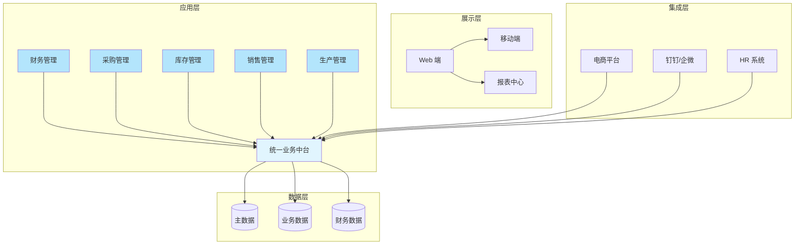

# 通用 ERP 解决方案

## 1. 客户现状与需求

### 项目概览

| 项目 | 内容 |
|------|------|
| **客户名称** | 目标企业（待定） |
| **项目名称** | 企业资源计划系统建设 |
| **项目类型** | 新建 |
| **核心目标** | 建立统一、高效的企业资源管理平台，实现业务流程标准化与业财一体化 |
| **预计周期** | 6-12 个月（视企业规模而定） |

### 客户概况

业务跑起来了，但数据散在各部门的系统里，老板想看全局经营数据得等财务月结。部门之间靠 Excel 和口头协调，跨部门的事推进起来费劲。近两年业务增长放缓，公司开始关注内部效率，管理层想把数字化系统建起来。

### 当前现状与挑战

| # | 挑战 | 影响 | 紧迫性 |
|---|------|------|--------|
| 1 | 信息孤岛严重，跨部门数据不一致 | 业务协同效率低，数据核对工作量大 | 高 |
| 2 | 业务流程依赖人工流转，审批周期长 | 业务响应速度慢，客户体验受影响 | 高 |
| 3 | 财务与业务脱节，月结周期长 | 管理层难以实时掌握经营状况 | 高 |
| 4 | 库存管理粗放，积压与缺货并存 | 资金占用高，经营成本难以控制 | 中 |
| 5 | 缺乏统一的数据分析平台 | 经营洞察不足，决策缺乏数据支撑 | 中 |

### 核心需求

#### 业务需求

| # | 需求 | 优先级 | 置信度 | 来源 |
|---|------|--------|--------|------|
| 1 | 建立统一的业务流程管理平台 | P0 | 已确认 | 通用需求 |
| 2 | 实现采购、库存、生产、销售全链路打通 | P0 | 已确认 | 通用需求 |
| 3 | 财务业务一体化，实时成本核算 | P0 | 已确认 | 通用需求 |
| 4 | 移动端审批与业务处理 | P1 | 已确认 | 通用需求 |

#### 功能需求

| # | 需求 | 优先级 | 置信度 | 来源 |
|---|------|--------|--------|------|
| 1 | 财务管理（总账、应收、应付、固定资产） | P0 | 已确认 | 通用需求 |
| 2 | 供应链管理（采购、库存、仓储） | P0 | 已确认 | 通用需求 |
| 3 | 销售管理（报价、订单、发运、结算） | P0 | 已确认 | 通用需求 |
| 4 | 生产管理（计划、工序、成本） | P1 | 已确认 | 通用需求 |

#### 技术需求

| # | 需求 | 优先级 | 置信度 | 来源 |
|---|------|--------|--------|------|
| 1 | 支持本地部署或云端部署 | P1 | 已确认 | 通用需求 |
| 2 | 系统开放 API，支持第三方集成 | P1 | 已确认 | 通用需求 |
| 3 | 数据安全与权限管理 | P0 | 已确认 | 通用需求 |

### 约束条件

- **预算**：参考行业水平，中大型企业 ERP 项目通常在 100-500 万元区间
- **时间**：期望 6-12 个月内完成核心模块上线
- **技术**：需兼容企业现有数据库和网络环境
- **资源**：企业需配备专职关键用户配合实施

---

## 2. 解决方案

### 整体思路

方案核心是打通财务和业务——订单下了自动生成应收，采购入库自动记账，不用财务再手动核对数据。

分两步走：先上财务、采购、库存三个模块，这三块关联最紧密，上线后能立刻看到效果；再扩展生产和销售，最后做数据报表。

上线方式采用分期切换，新旧系统并行一段时间，确保数据对得上再全面切换。

### 方案架构

### 功能设计

| 功能模块 | 解决的问题 | 业务价值 |
|---------|-----------|---------|
| **财务管理** | 财务业务脱节、数据不一致 | 业财一体化，自动生成凭证，月结效率提升 60% |
| **采购管理** | 采购流程不规范、供应商管理分散 | 规范采购流程，供应商协同效率提升，采购成本降低 5-10% |
| **库存管理** | 库存数据滞后、账实不符 | 实时库存监控，库存周转率提升，呆滞库存减少 |
| **销售管理** | 销售流程分散、客户信息分散 | 统一客户管理，销售预测准确率提升，订单响应时间缩短 |
| **生产管理** | 生产计划粗放、成本核算困难 | 精细化生产计划，车间执行透明，制造成本降低 10-15% |
| **报表中心** | 数据分散、报表制作耗时 | 自助式报表分析，管理层随时掌握经营状况 |

### 技术方案

| 组件 | 技术选型 | 说明 |
|------|---------|------|
| **部署方式** | 支持 SaaS / 私有化 | 根据企业 IT 战略灵活选择 |
| **数据库** | MySQL / PostgreSQL / Oracle | 支持主流数据库 |
| **中间件** | 分布式架构，支持高可用 | 微服务设计，支持水平扩展 |
| **移动端** | H5 + 原生小程序 | 覆盖 iOS/Android，审批体验流畅 |
| **安全** | RBAC 权限体系，数据加密传输 | 符合等保要求 |

### 集成方案

标准 API 对接，主流办公软件预置连接器，配置一下就能用：

| 集成对象 | 集成内容 | 实现方式 |
|---------|---------|---------|
| 钉钉/企业微信 | 移动审批、消息通知 | 预置连接器，配置即用 |
| 电商平台 | 订单自动同步、库存更新 | 标准 API 对接 |
| 银行系统 | 银企直连、自动对账 | API 集成 |
| HR 系统 | 组织架构同步、人员管理 | 主数据同步 |

---

## 3. 实施路径

### 阶段概览

| 阶段 | 周期 | 核心目标 | 关键交付物 |
|------|------|---------|-----------|
| **启动** | 2-4 周 | 项目立项，需求确认 | 项目章程、蓝图设计、实施计划 |
| **蓝图设计** | 4-6 周 | 业务流程梳理，系统配置 | 蓝图文档、接口方案、数据标准 |
| **系统实现** | 8-16 周 | 系统配置、定制开发 | 功能测试报告、集成测试报告 |
| **UAT 测试** | 2-4 周 | 用户验收测试 | 测试报告、操作手册 |
| **上线切换** | 2-4 周 | 数据迁移，系统切换 | 上线报告、切换方案 |
| **持续优化** | 持续 | 运营支持，持续改进 | 月度运营报告、优化建议 |

### 关键里程碑

| # | 里程碑 | 时间 | 验收标准 |
|---|--------|------|---------|
| 1 | 蓝图评审通过 | 第 6-10 周 | 业务流程经客户确认 |
| 2 | 核心模块上线 | 第 16-24 周 | 财务、采购、库存模块可用 |
| 3 | 全模块上线 | 第 24-36 周 | 所有规划模块可用 |
| 4 | 项目验收 | 第 36-48 周 | 稳定运行 3 个月，无重大缺陷 |

### 风险控制策略

时间紧张时，采用"核心优先"策略：优先上线业务核心模块，辅助功能分批迭代，避免一次性上线带来的质量风险。

---

## 4. 风险与下一步

### 风险识别与应对

| # | 风险 | 概率 | 影响 | 应对措施 |
|---|------|------|------|----------|
| 1 | 需求蔓延导致项目失控 | 中 | 高 | 严格变更管理，核心需求优先，次要需求分批实现 |
| 2 | 数据迁移质量不达标 | 中 | 高 | 提前制定数据清洗标准，分批验证，保留手工台账过渡期 |
| 3 | 关键用户配合度不足 | 中 | 中 | 明确双方职责，与客户高层对齐项目重要性 |
| 4 | 系统性能不满足预期 | 低 | 中 | 技术方案评审阶段充分压测，性能指标写入验收标准 |
| 5 | 终端用户 adoption 不足 | 中 | 中 | 充分的培训计划，启用阶段配备现场支持 |

### 下一步行动

| # | 行动 | 负责方 | 建议时间 |
|---|------|--------|---------|
| 1 | 需求详细调研与确认 | 双方 | 启动阶段 |
| 2 | 技术方案评审 | 我方 | 蓝图阶段 |
| 3 | 商务条款洽谈 | 双方 | 需求确认后 |
| 4 | 合同签署与项目启动 | 双方 | 商务达成一致后 |

---

<!-- INTERNAL_NOTES
## 假设前提
- 目标企业为中大型制造业或商贸企业，年营收规模在 1 亿元以上
- 企业已具备基本的网络和 IT 基础设施
- 项目期间企业能配备 3-5 名全职关键用户配合

## 知识库引用
- 参考模型：制造业 ERP 通用架构 | L3 | 用于第 2 章方案架构
- 参考方向：中大型企业 ERP 实施方法论 | L2 | 用于第 3 章实施路径
-->
